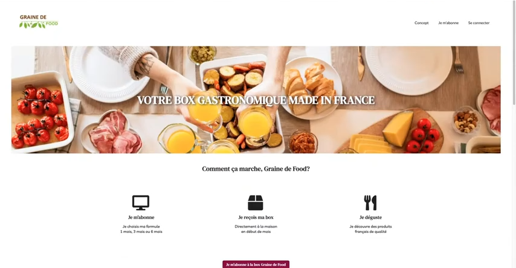
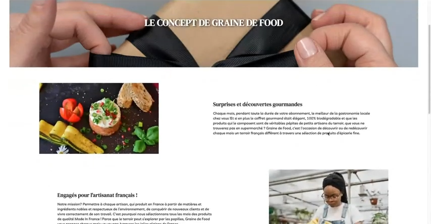
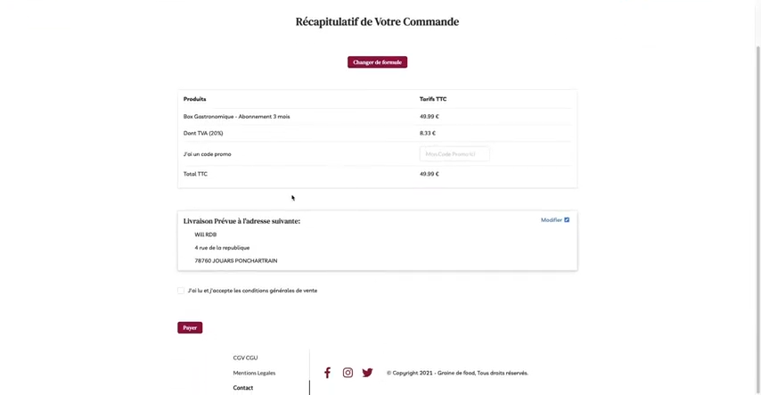
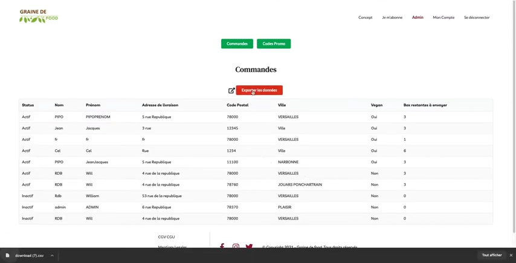
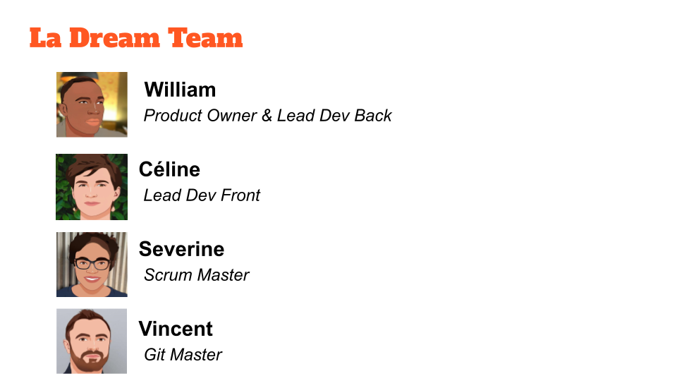

# Graine de Food
**_MVP built in 4 weeks by an Agile team of 4 fullstack Javascript developers, all trained at Ecole O'Clock._**

This project was showcased on YouTube on May 4, 2021. The video is in French but you can see our website in action. **Click on the below image to watch the presentation** (starts at 41:11 and lasts about 15 minutes):

## Goal of the project
___

Graine de Food was created for French content creator [Graine de Magie](https://www.instagram.com/grainedemagie/?hl=fr "Link to Graine de Magie Instagram Page"). She wanted an **e-commerce platform** where she could sell local food in subscription boxes to her followers. She gave us free rein to build the website from scratch. 

## Technologies
___

Graine de Food was built with the following technologies:
* Frontend: React and Redux
* Layout: Semantic UI customized with SASS
* API: Node / Express and Sequelize (MVC design pattern)
* Database: PostgreSQL
* Payment system: Stripe
* API deployed on AWS

## Features
___

* Minimalist and responsive design
* Presentation of concept and service
* Creation, authentication and management of customer accounts (CRUD)
* Online order and payment
* Admin-only pages to manage promo codes (CRUD) and to export the list of paid orders in CSV

## My role as a Scrum Master
___

Although we all worked on both frontend and backend development, each member had an additional area of expertise that helped with our organization and decision process. 

I was Scrum Master, in charge of hosting daily stand-up meetings, maintaining the team's kanban and schedule, as well as writing the project logbook. 

This role suited me well, thanks to my 10-year experience as a sales administrator and production coordinator.

